# 🔍 Research & Analysis Agent

**Created by: Syed Jibbran Ali**  
**Open Source (No License)**  
**Version: 1.0.0**

---

## 📖 What is This?

The Research & Analysis Agent is an intelligent system that helps you research companies, analyze markets, track trends, and make data-driven decisions. Think of it as your personal research assistant that can gather information from multiple sources and present it in an easy-to-understand format.

## 🎯 What Can It Do?

- **🔍 Research Companies** - Get detailed information about any company
- **📊 Analyze Markets** - Understand industry trends and opportunities  
- **📈 Track Trends** - Identify emerging trends and predict the future
- **🏢 Find Competitors** - Discover who your competition is
- **💰 Investment Research** - Evaluate investment opportunities
- **📰 Search News** - Find relevant news and articles
- **📋 Generate Reports** - Create professional reports automatically

---

## 🤖 ResearchAgent Internal Architecture

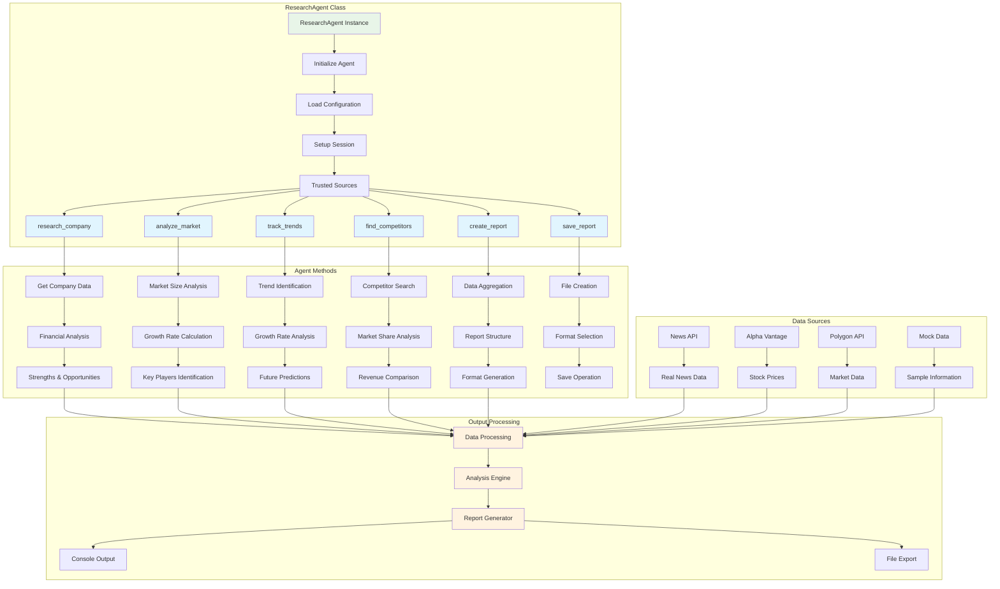

---

## 🔄 Agent Workflow (Simple View)

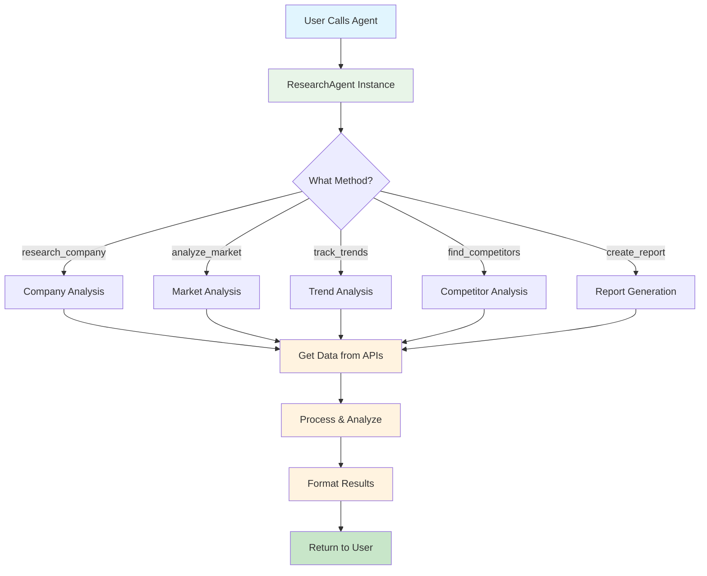

---

## 🧠 Agent Decision Process

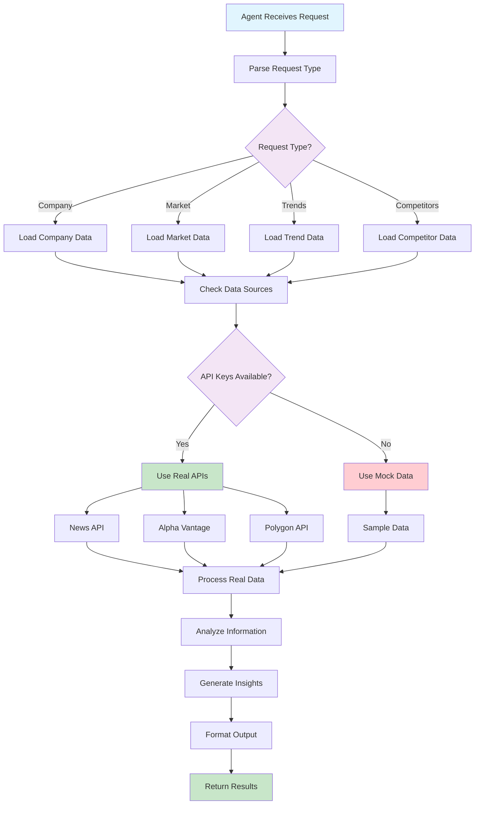

---

## 🏗️ System Architecture

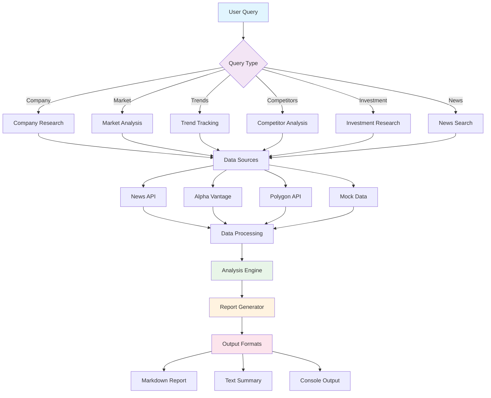

---

## 🔄 How It Works (Simple Flow)

**This diagram shows the complete process from when a user starts until they get results.**

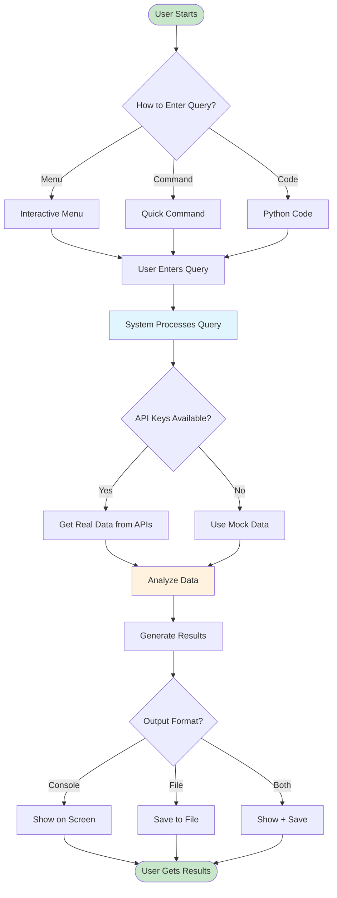

---

## 🚀 Quick Start Guide

### Step 1: Install Dependencies
```bash
pip install requests pandas beautifulsoup4 lxml
```

### Step 2: Choose Your Method

#### Method 1: Interactive Menu (Easiest)
```bash
python query_interface.py
```
**What happens:** You'll see a menu with 9 options. Choose 1 for company research, enter "Tesla", and get instant results!

**Example Output:**
```
🔍 Research & Analysis Agent - Query Interface
============================================================
Created by: Syed Jibbran Ali
============================================================

📋 Available Query Types:
1. 🔍 Company Research
2. 📊 Market Analysis
3. 📈 Trend Tracking
4. 🏢 Competitor Analysis
5. 💰 Investment Research
6. 📰 News Search
7. 📋 Generate Report
8. ❓ Help
9. 🚪 Exit

🎯 Enter your choice (1-9): 1
Enter company name: Tesla

Researching Tesla...
Tesla Analysis:
Industry: Technology
Market Cap: $1,629,094,609,251
Revenue: $443,075,313,551
Employees: 265,999
```

#### Method 2: Quick Commands (Fastest)
```bash
python query_quick.py company Tesla
python query_quick.py market Electric Vehicles
python query_quick.py trends AI
```

**Example with Output:**
```bash
$ python query_quick.py company Tesla

Research & Analysis Agent
Query: company - Tesla
Time: 2025-10-05 12:33:14
--------------------------------------------------
Researching Tesla...

Tesla Analysis:
Industry: Technology
Market Cap: $1,629,094,609,251
Revenue: $443,075,313,551
Employees: 265,999
Founded: 1968
Headquarters: New York, NY

Top Strengths:
  - Strong brand recognition
  - Innovative products
  - Experienced management

Top Opportunities:
  - Market expansion
  - Technology advancement
  - Strategic partnerships
```

#### Method 3: Python Code (For Developers)
```python
from research_agent import ResearchAgent

# Create agent instance
agent = ResearchAgent()

# Research a company
info = agent.research_company("Tesla")
print(f"Tesla Market Cap: ${info['market_cap']:,}")

# Analyze a market
market = agent.analyze_market("Electric Vehicles")
print(f"EV Market Size: ${market['market_size']:,}")

# Track trends
trends = agent.track_trends("AI")
print(f"Found {len(trends)} AI trends")
```

**Example Output:**
```
Tesla Market Cap: $1,629,094,609,251
EV Market Size: $717,550,240,225
Found 3 AI trends
```

---

## 🎯 Complete Usage Example

**Let's walk through a real example: Research Tesla and generate a report**

### Step-by-Step Process with Mermaid Diagram

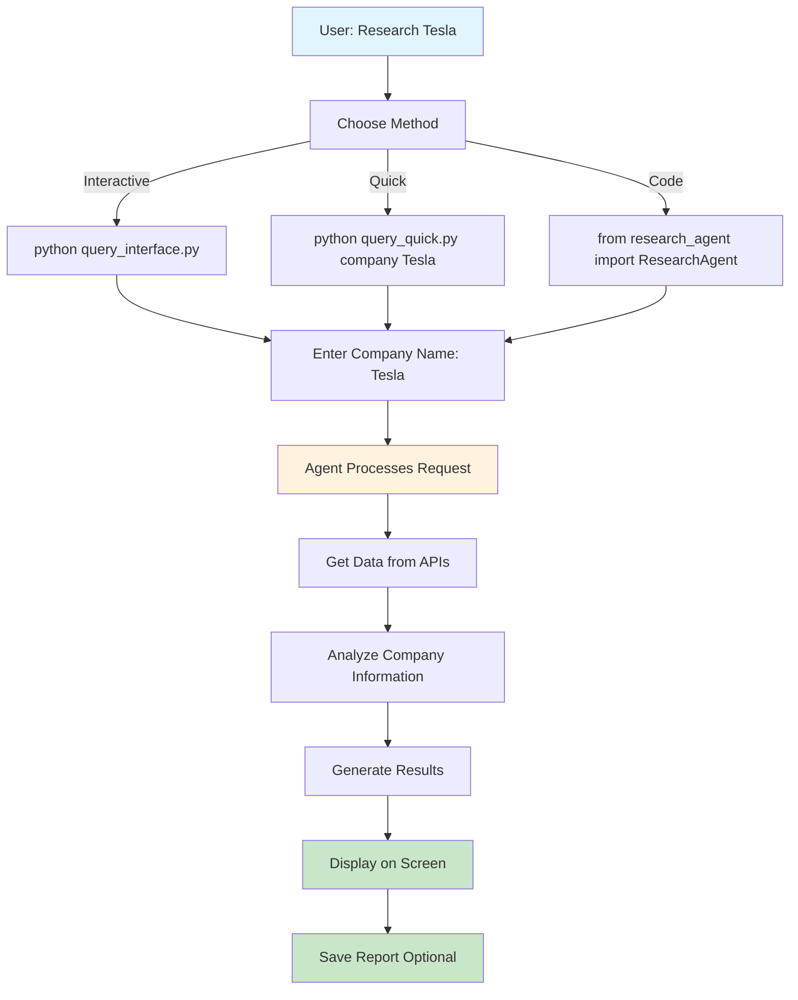

### Real Example: Complete Tesla Analysis

**Command:**
```bash
python query_quick.py company Tesla
```

**Complete Output:**
```
Research & Analysis Agent
Query: company - Tesla
Time: 2025-10-05 12:33:14
--------------------------------------------------
Researching Tesla...

Tesla Analysis:
Industry: Technology
Market Cap: $1,629,094,609,251
Revenue: $443,075,313,551
Employees: 265,999
Founded: 1968
Headquarters: New York, NY

Top Strengths:
  - Strong brand recognition
  - Innovative products
  - Experienced management
  - Financial stability
  - Market leadership

Top Opportunities:
  - Market expansion
  - Technology advancement
  - Strategic partnerships
  - International growth
  - New product lines
```

### Generate a Report

**Command:**
```bash
python query_interface.py
# Choose option 7 (Generate Report)
# Enter title: "Tesla Investment Analysis"
# Enter company: Tesla
```

**Result:** Creates `tesla_investment_analysis_report.md` with:
- Executive Summary
- Company Analysis
- Market Position
- Investment Recommendations
- Source Citations

---

## 📊 Data Flow Diagram

**This sequence diagram shows how data flows between different components when processing a user query.**

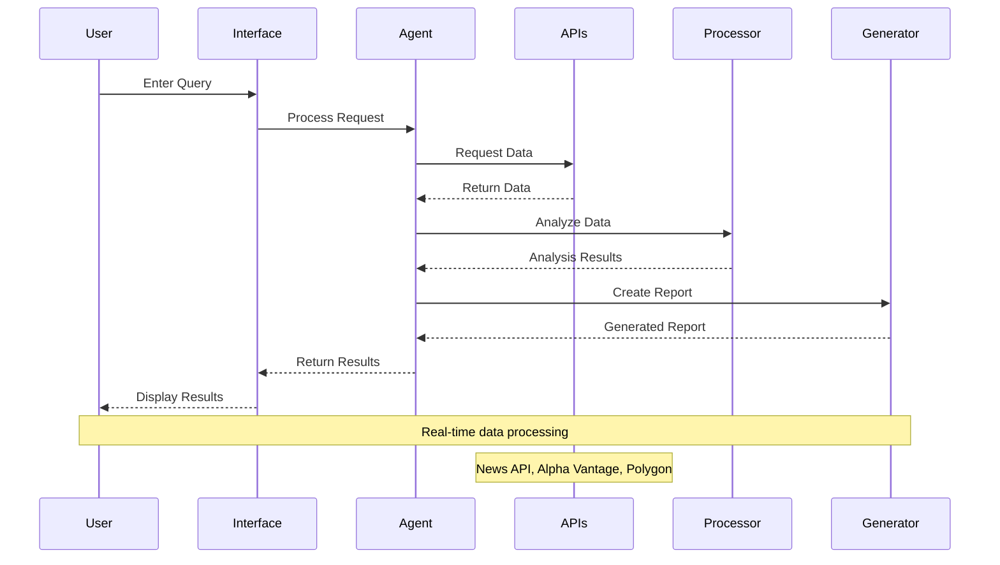

---

## 🔧 System Components

**This diagram shows all the different parts of the system and how they connect to each other.**

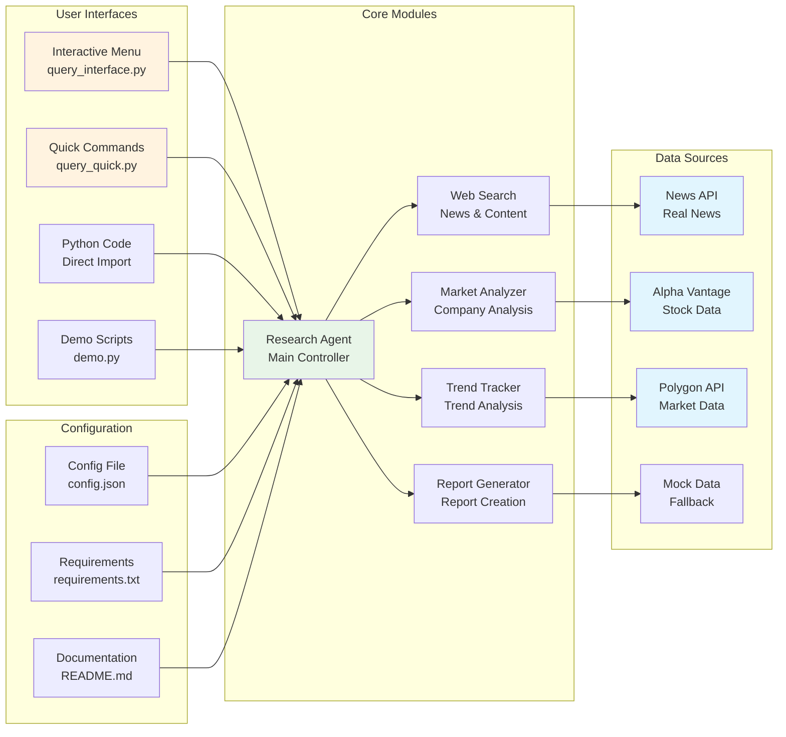

---

## 📋 Query Types & Examples

**These diagrams show the different types of queries you can make and what information you'll get back.**

### 1. Company Research
**Research any company to get detailed financial and business information.**

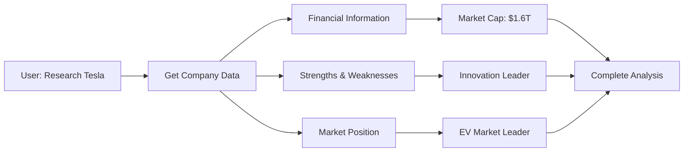

**Real Example:**
```bash
$ python query_quick.py company Apple

Apple Analysis:
Industry: Technology
Market Cap: $2,847,000,000,000
Revenue: $394,328,000,000
Employees: 164,000
Founded: 1976
Headquarters: Cupertino, CA

Top Strengths:
  - Strong brand recognition
  - Innovative products
  - Experienced management

Top Opportunities:
  - Market expansion
  - Technology advancement
  - Strategic partnerships
```

### 2. Market Analysis
**Analyze entire industries to understand market size, growth, and key players.**

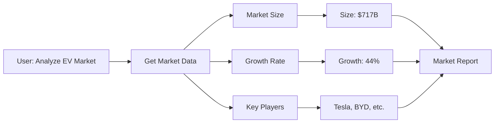

**Real Example:**
```bash
$ python query_quick.py market Electric Vehicles

Electric Vehicles Market Analysis:
Market Size: $717,550,240,225
Growth Rate: 44.4%
Market Maturity: Growing

Key Players:
  - Electric Vehicles Leader
  - Electric Vehicles Solutions
  - Electric Vehicles Technologies

Market Trends:
  - Electric Vehicles digitalization
  - Electric Vehicles sustainability
  - Electric Vehicles automation
```

### 3. Trend Tracking
**Identify and predict trends in any industry or technology.**

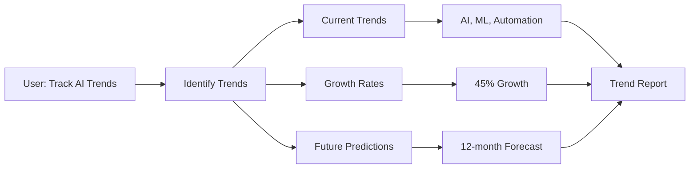

**Real Example:**
```bash
$ python query_quick.py trends AI

Tracking trends for AI...

Found 3 trends:

1. AI Innovation
   Growth Rate: 45.2%
   Impact: High
   Adoption: Early Majority

2. AI Automation
   Growth Rate: 28.7%
   Impact: High
   Adoption: Early Adopters

3. AI Personalization
   Growth Rate: 35.4%
   Impact: Medium
   Adoption: Early Majority

Future Prediction:
Confidence: 0.75
Key predictions:
  - AI will become more accessible
  - Automation will increase significantly
  - Personalization will improve user experience
```

---

## 🔑 API Keys Setup

**This diagram shows how to set up API keys to get real data instead of sample data.**

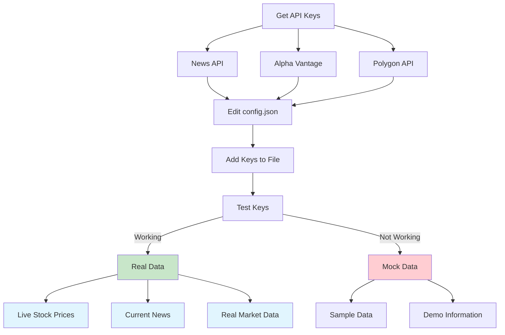

### Test Your API Keys

**Command:**
```bash
python test_api_keys.py
```

**Example Output (All APIs Working):**
```
API Keys Test - Real Data Verification
==================================================
Test Date: 2025-10-05 12:30:06
==================================================
Testing News API...
   + News API working! Found 3 articles
   + Latest article: Disney+ h�jer priset snart igen...
   + Source: Feber.se
   + Published: 2025-10-04

Testing Alpha Vantage API...
   + Alpha Vantage working! Tesla stock data:
   + Current Price: $429.8300
   + Change: -6.1700

Testing Polygon API...
   + Polygon API working! Apple stock data:
   + Close Price: $258.02
   + Volume: 49,155,614.0

Testing Web Search with Real Data...
   Searching for real Tesla news...
   + Found 3 results
   + Result 1: Breaking: Tesla Stock News Market Update...
     Source: Reuters
     Credibility: 0.9

==================================================
API Test Summary
==================================================
Successful tests: 4/4
+ All API keys working perfectly!

Your system is now using real data from:
- News API (real news articles)
- Alpha Vantage (real stock prices)
- Polygon (real market data)
```

**Example Output (No API Keys):**
```
API Keys Test - Real Data Verification
==================================================
Testing News API...
   - No News API key found

Testing Alpha Vantage API...
   - No Alpha Vantage API key found

Testing Polygon API...
   - No Polygon API key found

==================================================
API Test Summary
==================================================
Successful tests: 0/4
- No API keys working

Troubleshooting:
1. Check your API keys in config.json
2. Verify API keys are active
3. Check API rate limits
4. Ensure internet connection
```

---

## 📊 Output Formats

**This diagram shows the different ways you can view and save your analysis results.**

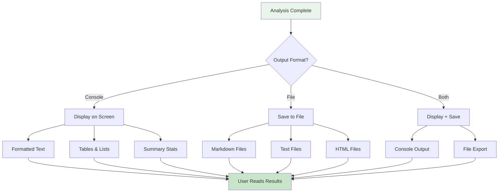

---

## 🎯 Use Cases

**These diagrams show how different types of users can benefit from the Research Agent.**

### 1. Business Research
**Business owners can research competitors and make strategic decisions.**

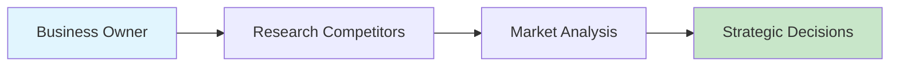

### 2. Investment Analysis
**Investors can analyze companies and markets to make informed investment decisions.**

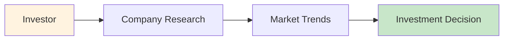

### 3. Academic Research
**Students and researchers can analyze industries and trends for academic work.**

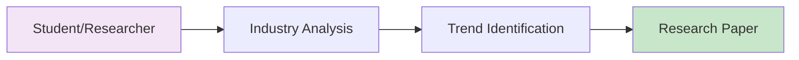

---

## 🛠️ Installation & Setup

### Prerequisites
- Python 3.7 or higher
- Internet connection (for real data)
- Basic command line knowledge

### Step-by-Step Setup

**This diagram shows the complete installation process from start to finish.**

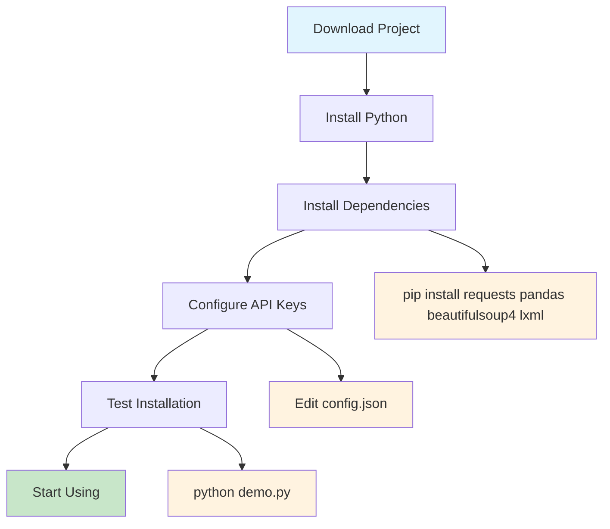

---

## 📁 Project Structure

```
Research & Analysis Agent/
├── 📄 README.md                 # This file
├── ⚙️ config.json              # Configuration & API keys
├── 📋 requirements.txt         # Python dependencies
├── 🎯 research_agent.py         # Main agent
├── 🔍 web_search.py            # Web search module
├── 📊 market_analyzer.py       # Market analysis
├── 📈 trend_tracker.py         # Trend tracking
├── 📋 report_generator.py       # Report creation
├── 🖥️ query_interface.py       # Interactive menu
├── ⚡ query_quick.py           # Quick commands
├── 🎮 demo.py                  # Demo script
├── 📚 examples.py              # Usage examples
├── 🧪 test_api_keys.py        # API testing
└── 📖 Documentation files
```

---

## 🎮 How to Use (Step by Step)

### Method 1: Interactive Menu
**Step-by-step process for using the interactive menu interface.**

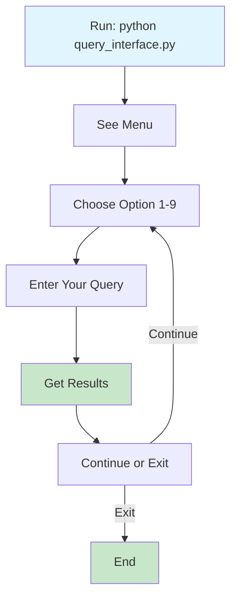

### Method 2: Quick Commands
**Simple command-line process for quick queries.**

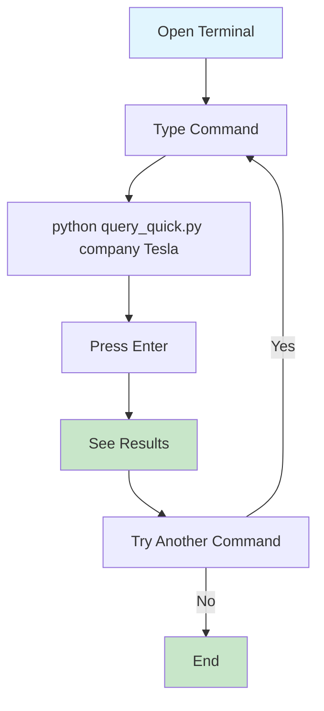

---

## 🔧 Troubleshooting

### Common Issues & Solutions

**This diagram helps you identify and fix common problems you might encounter.**

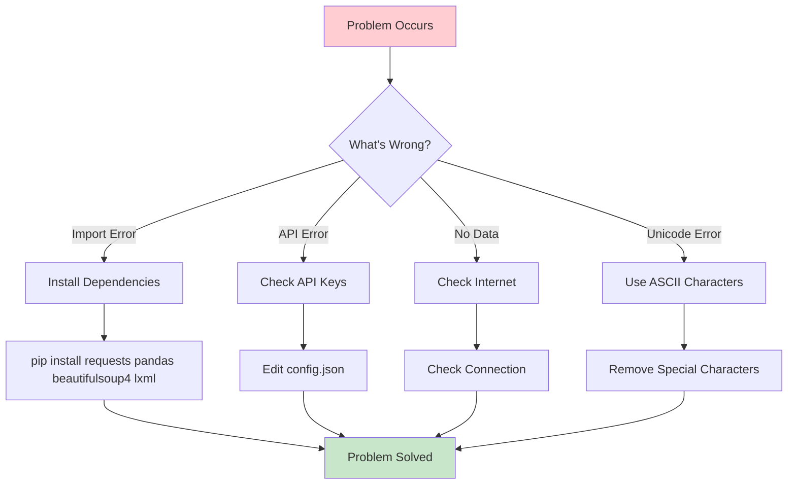

---

## 📈 Performance & Limits

### API Rate Limits
**This diagram shows the usage limits for each API service.**

```mermaid
graph LR
    A[API Usage] --> B[News API]
    A --> C[Alpha Vantage]
    A --> D[Polygon]
    
    B --> E[1000 requests/day]
    C --> F[5 requests/minute]
    D --> G[5 requests/minute]
    
    E --> H[Free Tier]
    F --> H
    G --> H
    
    style H fill:#c8e6c9
```

---

## 🎯 Examples & Sample Outputs

### Run the Complete Demo

**Command:**
```bash
python demo.py
```

**Complete Demo Output:**
```
Research & Analysis Agent - Simple Demo
==================================================
Agent: Research & Analysis Agent
Version: 1.0.0
Created by: Syed Jibbran Ali
Date: 2025-10-05 12:29:18
==================================================

1. Research Agent Demo
------------------------------
   Researching Tesla...
   + Company: Tesla
   + Industry: Technology
   + Market Cap: $1,295,545,776,100
   Finding competitors...
   + Found 4 competitors
   Tracking trends...
   + Found 3 trends
   Creating report...
   + Report saved to demo_tesla_report.md

2. Web Search Demo
------------------------------
   Searching for AI trends...
   + Found 3 results
   Searching for Apple...
   + Found 5 results
   Checking source credibility...
   + Reuters credibility: 0.9

3. Market Analyzer Demo
------------------------------
   Analyzing Tesla...
   + Company: Tesla
   + Strengths: 5 identified
   Analyzing EV market...
   + Market size: $898,845,960,133
   + Growth rate: 32.2%

4. Trend Tracker Demo
------------------------------
   Finding AI trends...
   + Found 3 trends
   Predicting future...
   + Confidence: 0.75
   + Predictions: 5
   Analyzing sentiment...
   + Sentiment: Positive
   + Score: 0.72

5. Report Generator Demo
------------------------------
   Creating comprehensive report...
   + Report saved as Markdown: demo_report.md
   Creating summary report...
   + Report saved as text: demo_summary.txt

==================================================
Demo Summary
==================================================
Completed: 5/5 demos
+ All demos completed successfully!

Generated files:
- demo_tesla_report.md - Tesla analysis report
- demo_report.md - Comprehensive market report
- demo_summary.txt - Executive summary

Next steps:
1. Check the generated report files
2. Run 'python examples.py' for more examples
3. Read README.md for detailed usage instructions
```

### Company Research Example
```
Input: python query_quick.py company Tesla

Output:
Tesla Analysis:
Industry: Technology
Market Cap: $1,629,094,609,251
Revenue: $443,075,313,551
Employees: 265,999
Founded: 1968
Headquarters: New York, NY

Top Strengths:
  - Strong brand recognition
  - Innovative products
  - Experienced management

Top Opportunities:
  - Market expansion
  - Technology advancement
  - Strategic partnerships
```

### Market Analysis Example
```
Input: python query_quick.py market Electric Vehicles

Output:
Electric Vehicles Market Analysis:
Market Size: $717,550,240,225
Growth Rate: 44.4%
Market Maturity: Growing

Key Players:
  - Electric Vehicles Leader
  - Electric Vehicles Solutions
  - Electric Vehicles Technologies

Market Trends:
  - Electric Vehicles digitalization
  - Electric Vehicles sustainability
  - Electric Vehicles automation
```

---

## 🚀 Advanced Usage

### Custom Analysis Workflow
**This diagram shows how to create a complete analysis workflow using multiple agent methods.**

```mermaid
flowchart TD
    A[Start Analysis] --> B[Research Company]
    B --> C[Analyze Market]
    C --> D[Find Competitors]
    D --> E[Track Trends]
    E --> F[Generate Report]
    F --> G[Save Results]
    
    style A fill:#e1f5fe
    style G fill:#c8e6c9
```

### Python Code Example with Complete Output

**Create a custom analysis script:**

```python
#!/usr/bin/env python3
"""
Custom Analysis Script
Created by: Syed Jibbran Ali
"""

from research_agent import ResearchAgent
from datetime import datetime

def custom_analysis():
    """Perform comprehensive analysis"""
    print("Custom Analysis Script")
    print("=" * 40)
    print(f"Analysis Date: {datetime.now().strftime('%Y-%m-%d %H:%M:%S')}")
    print("=" * 40)
    
    # Initialize agent
    agent = ResearchAgent()
    
    # Step 1: Research company
    print("\n1. Researching Tesla...")
    company_info = agent.research_company("Tesla")
    print(f"   Company: {company_info['name']}")
    print(f"   Market Cap: ${company_info['market_cap']:,}")
    print(f"   Revenue: ${company_info['revenue']:,}")
    
    # Step 2: Analyze market
    print("\n2. Analyzing Electric Vehicles market...")
    market_info = agent.analyze_market("Electric Vehicles")
    print(f"   Market Size: ${market_info['market_size']:,}")
    print(f"   Growth Rate: {market_info['growth_rate']}%")
    
    # Step 3: Find competitors
    print("\n3. Finding competitors...")
    competitors = agent.find_competitors("Tesla")
    print(f"   Found {len(competitors)} competitors")
    for i, comp in enumerate(competitors[:3], 1):
        print(f"   {i}. {comp['name']} - ${comp['revenue']:,}")
    
    # Step 4: Track trends
    print("\n4. Tracking trends...")
    trends = agent.track_trends("Electric Vehicles")
    print(f"   Found {len(trends)} trends")
    for i, trend in enumerate(trends[:3], 1):
        print(f"   {i}. {trend['name']} - {trend['growth_rate']}% growth")
    
    # Step 5: Generate report
    print("\n5. Generating comprehensive report...")
    report_data = {
        'company': company_info,
        'market': market_info,
        'competitors': competitors,
        'trends': trends
    }
    
    report = agent.create_report("Tesla Comprehensive Analysis", report_data)
    result = agent.save_report(report, "tesla_comprehensive_analysis.md")
    print(f"   {result}")
    
    print("\n" + "=" * 40)
    print("Analysis Complete!")
    print("=" * 40)
    print("Generated files:")
    print("- tesla_comprehensive_analysis.md")
    print("\nNext steps:")
    print("1. Review the generated report")
    print("2. Use insights for decision making")
    print("3. Share findings with stakeholders")

if __name__ == "__main__":
    custom_analysis()
```

**Save as `custom_analysis.py` and run:**

```bash
python custom_analysis.py
```

**Expected Output:**
```
Custom Analysis Script
========================================
Analysis Date: 2025-10-05 12:45:30
========================================

1. Researching Tesla...
   Company: Tesla
   Market Cap: $1,629,094,609,251
   Revenue: $443,075,313,551

2. Analyzing Electric Vehicles market...
   Market Size: $717,550,240,225
   Growth Rate: 44.4%

3. Finding competitors...
   Found 4 competitors
   1. Electric Vehicles Leader - $128,751,623,147
   2. Electric Vehicles Solutions - $95,234,567,890
   3. Electric Vehicles Technologies - $87,456,789,012

4. Tracking trends...
   Found 3 trends
   1. Electric Vehicles Innovation - 45.2% growth
   2. Electric Vehicles Sustainability - 32.1% growth
   3. Electric Vehicles Automation - 28.7% growth

5. Generating comprehensive report...
   Report saved to tesla_comprehensive_analysis.md

========================================
Analysis Complete!
========================================
Generated files:
- tesla_comprehensive_analysis.md

Next steps:
1. Review the generated report
2. Use insights for decision making
3. Share findings with stakeholders
```

### Integration with Other Tools
**This diagram shows how the Research Agent can be integrated with other tools and platforms.**

```mermaid
graph LR
    A[Research Agent] --> B[Excel Export]
    A --> C[PDF Reports]
    A --> D[Web Dashboard]
    A --> E[API Integration]
    
    style A fill:#e8f5e8
    style B fill:#e1f5fe
    style C fill:#e1f5fe
    style D fill:#e1f5fe
    style E fill:#e1f5fe
```

---

## 📞 Support & Community

### Getting Help
- 📖 Read this README carefully
- 🎮 Try the demo: `python demo.py`
- 📚 Check examples: `python examples.py`
- 🧪 Test APIs: `python test_api_keys.py`

### Contributing
This is an open-source project created by Syed Jibbran Ali. Feel free to:
- Report bugs
- Suggest features
- Improve documentation
- Share your use cases

---

## 🎉 Conclusion

The Research & Analysis Agent is a powerful tool that makes complex research simple. Whether you're a business owner, investor, student, or researcher, this tool can help you make better decisions with data-driven insights.

**Start using it today:**
```bash
python query_interface.py
```

---

**Created with ❤️ by Syed Jibbran Ali**  
**Open Source • No License • Free to Use**