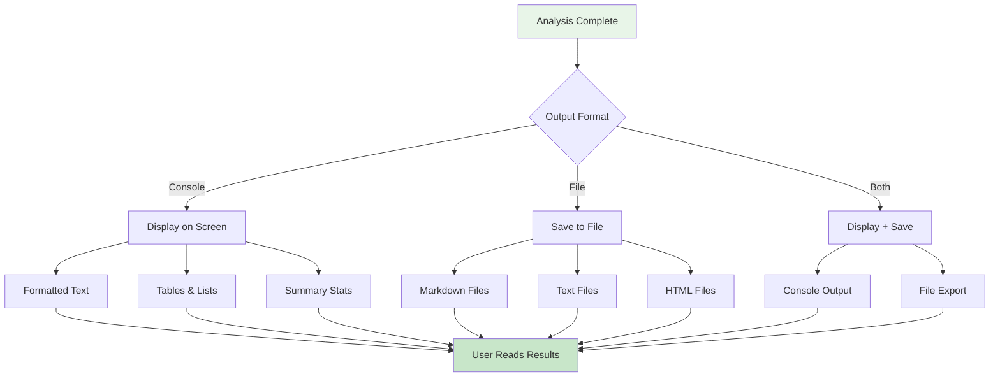
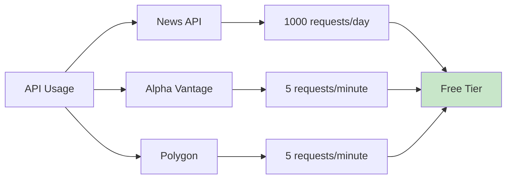

# 🔍 Research & Analysis Agent

**Created by: Syed Jibbran Ali**  
**Open Source (No License)**  
**Version: 1.0.0**

---

## 📖 What is This?

The Research & Analysis Agent is an intelligent system that helps you research companies, analyze markets, track trends, and make data-driven decisions. Think of it as your personal research assistant that can gather information from multiple sources and present it in an easy-to-understand format.

## 🎯 What Can It Do?

- **🔍 Research Companies** - Get detailed information about any company
- **📊 Analyze Markets** - Understand industry trends and opportunities  
- **📈 Track Trends** - Identify emerging trends and predict the future
- **🏢 Find Competitors** - Discover who your competition is
- **💰 Investment Research** - Evaluate investment opportunities
- **📰 Search News** - Find relevant news and articles
- **📋 Generate Reports** - Create professional reports automatically

---

## 🤖 ResearchAgent Internal Architecture


---

## 🔄 Agent Workflow (Simple View)


---

## 🧠 Agent Decision Process


---

## 🏗️ System Architecture


---

## 🔄 How It Works (Simple Flow)


---

## 🚀 Quick Start Guide

### Step 1: Install Dependencies
```bash
pip install requests pandas beautifulsoup4 lxml
```

### Step 2: Choose Your Method

#### Method 1: Interactive Menu (Easiest)
```bash
python query_interface.py
```
Then follow the menu prompts!

#### Method 2: Quick Commands (Fastest)
```bash
python query_quick.py company Tesla
python query_quick.py market Electric Vehicles
python query_quick.py trends AI
```

#### Method 3: Python Code (For Developers)
```python
from research_agent import ResearchAgent
agent = ResearchAgent()
info = agent.research_company("Tesla")
```

---

## 📊 Data Flow Diagram


---

## 🔧 System Components


---

## 📋 Query Types & Examples

### 1. Company Research
```mermaid
flowchart LR
    A[User: "Research Tesla"] --> B[Get Company Data]
    B --> C[Financial Information]
    B --> D[Strengths & Weaknesses]
    B --> E[Market Position]
    
    C --> F[Market Cap: $1.6T]
    D --> G[Innovation Leader]
    E --> H[EV Market Leader]
    
    F --> I[Complete Analysis]
    G --> I
    H --> I
```

### 2. Market Analysis
```mermaid
flowchart LR
    A[User: "Analyze EV Market"] --> B[Get Market Data]
    B --> C[Market Size]
    B --> D[Growth Rate]
    B --> E[Key Players]
    
    C --> F[Size: $717B]
    D --> G[Growth: 44%]
    E --> H[Tesla, BYD, etc.]
    
    F --> I[Market Report]
    G --> I
    H --> I
```

### 3. Trend Tracking
```mermaid
flowchart LR
    A[User: "Track AI Trends"] --> B[Identify Trends]
    B --> C[Current Trends]
    B --> D[Growth Rates]
    B --> E[Future Predictions]
    
    C --> F[AI, ML, Automation]
    D --> G[45% Growth]
    E --> H[12-month Forecast]
    
    F --> I[Trend Report]
    G --> I
    H --> I
```

---

## 🔑 API Keys Setup


---

## 📊 Output Formats



---

## 🎯 Use Cases

### 1. Business Research


### 2. Investment Analysis


### 3. Academic Research


---

## 🛠️ Installation & Setup

### Prerequisites
- Python 3.7 or higher
- Internet connection (for real data)
- Basic command line knowledge

### Step-by-Step Setup


---

## 📁 Project Structure

```
Research & Analysis Agent/
├── 📄 README.md                 # This file
├── ⚙️ config.json              # Configuration & API keys
├── 📋 requirements.txt         # Python dependencies
├── 🎯 research_agent.py         # Main agent
├── 🔍 web_search.py            # Web search module
├── 📊 market_analyzer.py       # Market analysis
├── 📈 trend_tracker.py         # Trend tracking
├── 📋 report_generator.py       # Report creation
├── 🖥️ query_interface.py       # Interactive menu
├── ⚡ query_quick.py           # Quick commands
├── 🎮 demo.py                  # Demo script
├── 📚 examples.py              # Usage examples
├── 🧪 test_api_keys.py        # API testing
└── 📖 Documentation files
```

---

## 🎮 How to Use (Step by Step)

### Method 1: Interactive Menu


### Method 2: Quick Commands


---

## 🔧 Troubleshooting

### Common Issues & Solutions


---

## 📈 Performance & Limits

### API Rate Limits


---

## 🎯 Examples & Sample Outputs

### Company Research Example
```
Input: python query_quick.py company Tesla

Output:
Tesla Analysis:
Industry: Technology
Market Cap: $1,629,094,609,251
Revenue: $443,075,313,551
Employees: 265,999
Founded: 1968
Headquarters: New York, NY

Top Strengths:
  - Strong brand recognition
  - Innovative products
  - Experienced management

Top Opportunities:
  - Market expansion
  - Technology advancement
  - Strategic partnerships
```

### Market Analysis Example
```
Input: python query_quick.py market Electric Vehicles

Output:
Electric Vehicles Market Analysis:
Market Size: $717,550,240,225
Growth Rate: 44.4%
Market Maturity: Growing

Key Players:
  - Electric Vehicles Leader
  - Electric Vehicles Solutions
  - Electric Vehicles Technologies

Market Trends:
  - Electric Vehicles digitalization
  - Electric Vehicles sustainability
  - Electric Vehicles automation
```

---

## 🚀 Advanced Usage

### Custom Analysis Workflow
```mermaid
flowchart TD
    A[Start Analysis] --> B[Research Company]
    B --> C[Analyze Market]
    C --> D[Find Competitors]
    D --> E[Track Trends]
    E --> F[Generate Report]
    F --> G[Save Results]
    
    style A fill:#e1f5fe
    style G fill:#c8e6c9
```

### Integration with Other Tools
```mermaid
graph LR
    A[Research Agent] --> B[Excel Export]
    A --> C[PDF Reports]
    A --> D[Web Dashboard]
    A --> E[API Integration]
    
    style A fill:#e8f5e8
    style B fill:#e1f5fe
    style C fill:#e1f5fe
    style D fill:#e1f5fe
    style E fill:#e1f5fe
```

---

## 📞 Support & Community

### Getting Help
- 📖 Read this README carefully
- 🎮 Try the demo: `python demo.py`
- 📚 Check examples: `python examples.py`
- 🧪 Test APIs: `python test_api_keys.py`

### Contributing
This is an open-source project created by Syed Jibbran Ali. Feel free to:
- Report bugs
- Suggest features
- Improve documentation
- Share your use cases

---

## 🎉 Conclusion

The Research & Analysis Agent is a powerful tool that makes complex research simple. Whether you're a business owner, investor, student, or researcher, this tool can help you make better decisions with data-driven insights.

**Start using it today:**
```bash
python query_interface.py
```

---

**Created with ❤️ by Syed Jibbran Ali**  
**Open Source • No License • Free to Use**